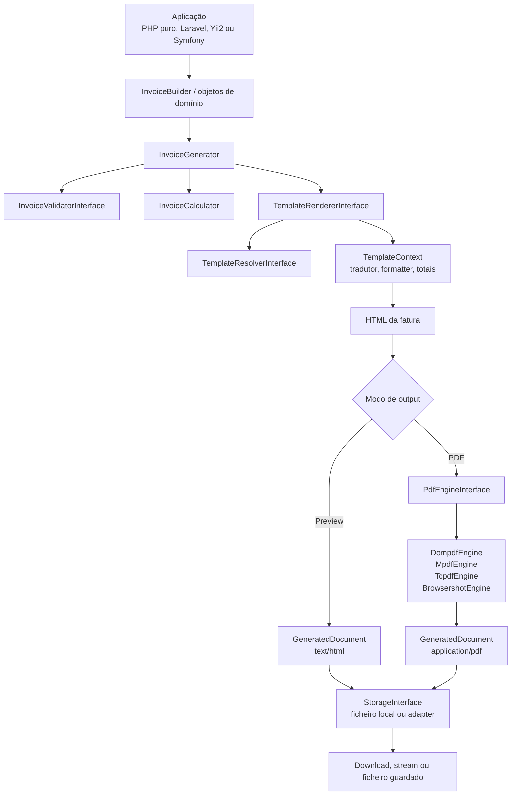

# Arquitetura proposta

## Resumo executivo

`pdf-invoices-php` e publicado como um package Composer unico,
`kowts/pdf-invoices`, seguindo o padrao do projeto `efaura`: core
independente em `src/` e integracoes opcionais em `src/Bridge/*`.

O core contem dominio, calculos, contratos, templates PHP nativos, traducao
basica, storage local e geracao de documentos. Os bridges so fazem integracao
com containers, tradutores, responses e filesystems de cada framework.

## Diagrama de dependencias

```text
Aplicacoes Laravel / Yii2 / Symfony / PHP puro
    ↓
Bridges opcionais em src/Bridge/*
    ↓
Contratos do core: renderer, engine PDF, storage, tradutor, formatter
    ↓
Dominio: Invoice, InvoiceItem, Party, Address, Money, Percentage, Quantity
    ↓
PHP 8.2+, sem framework obrigatório
```

## Fluxo de geração



## Estrutura principal

```text
src/
├── Bridge/
│   ├── Laravel/
│   ├── Symfony/
│   └── Yii2/
├── Builder/
├── Calculation/
├── Contract/
├── Domain/
├── Exception/
├── Formatting/
├── Localization/
├── Pdf/
├── Storage/
├── Support/
├── Template/
└── Validation/
resources/
├── templates/
└── translations/
tests/
examples/
docs/
config/
```

## Contratos principais

- `PdfEngineInterface`: recebe HTML e `PdfOptions`, devolve
  `GeneratedDocument`.
- `TemplateRendererInterface`: transforma um template e `TemplateContext` em
  HTML.
- `TemplateResolverInterface`: resolve nomes de templates para ficheiros.
- `StorageInterface`: grava, le, verifica e apaga documentos.
- `TranslatorInterface`: traduz labels sem acoplar ao mecanismo do framework.
- `CurrencyFormatterInterface`: formata `Money`.
- `InvoiceValidatorInterface`: valida faturas antes de gerar output.
- `AssetResolverInterface`: reservado para politica segura de assets.

## Matriz manter/adaptar/reescrever/remover

| Area | Decisao | Implementacao atual |
| --- | --- | --- |
| Builders | Adaptar | Builders fluentes no core, sem Laravel/Carbon. |
| DTOs | Adaptar | Objetos de dominio imutaveis. |
| Calculos | Reescrever | `InvoiceCalculator` com `Money` inteiro. |
| Templates | Adaptar | PHP nativo no core; Blade/Twig ficam opcionais. |
| PDF engines | Tornar opcionais | Dompdf, mPDF, TCPDF e Browsershot atras de `PdfEngineInterface`. |
| Storage Laravel | Mover | `LaravelStorage` fica em `src/Bridge/Laravel`. |
| Traducao Laravel | Mover | `LaravelTranslator` fica em `src/Bridge/Laravel`. |
| Facade | Opcional | Incluida no bridge Laravel, API principal usa DI. |
| Commands | Futuro | Nao e necessario no MVP. |
